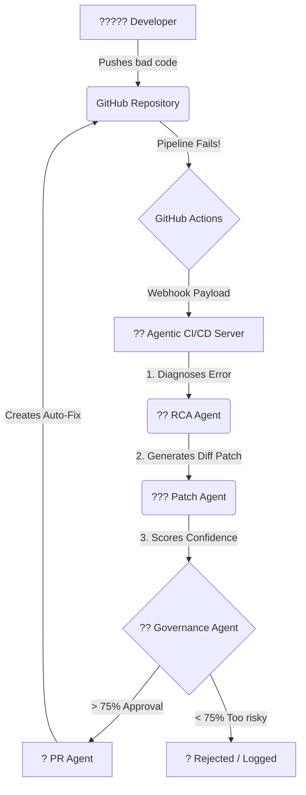

# Testing the Agentic CI/CD Pipeline By Pushing Code

Welcome! If you're a new user trying to understand **how this pipeline works, what it does, and what it is capable of**, this guide explains the end-to-end flow using a real, live example.

---

## ?? What This Pipeline Can Do
This system is an **autonomous bug-fixing pipeline**. When a developer writes bad code and pushes it to GitHub:
1. **It Detects:** It immediately notices that the CI/CD build failed (e.g., tests crashed, syntax is broken).
2. **It Diagnoses:** It uses an AI (RCA Agent) to read the exact error logs and figure out the "Root Cause".
3. **It Codes:** It writes an actual programmatic fix (a patch) for your code.
4. **It Evaluates:** It grades its own work (Governance Agent). If the fix isn't confident enough, it rejects it to prevent breaking things further.
5. **It Contributes:** If the fix is highly confident, it opens a Pull Request/Issue on GitHub containing the patched code so a developer can merge it immediately.

---

## ?? The Flow: How It Works in Motion



---

## ?? Real-World Example: Testing by Pushing

To safely demonstrate this pipeline without breaking a real production application, we orchestrate a mock project (the target).

### 1. Setting Up the Target Sandbox
1. A new GitHub project named `agentic-demo-target` is created.
2. A flawed piece of software is committed to the repository. For example, a Python file (`calc.py`) containing a strict `TypeError` (attempting to mathematically add an `int` and a `str`).
3. We set up a GitHub Actions CI workflow designed to run the code on every push.

### 2. Triggering the Process (The Push)
1. You make a push to the `main` branch of the target project containing the flawed code.
2. GitHub detects the push and fires the `Python CI` action.
3. The Action immediately crashes because of our intentional syntax error.
4. The GitHub Webhook feature automatically relays the failed payload directly to our backend server.

### 3. Observing the Orchestrator
If you are running the backend server locally, the moment the webhook hits, you will see the agents talking to each other in the terminal:

```powershell
[GIN] 2026/03/15 - 13:28:24 | 200 |   POST "/webhook/github"
{"msg":"Auto-approving patch creation"}
{"msg":"Creating automated Fix Pull Request","repo":"agentic-demo-target"}
{"msg":"Successfully created Auto-Fix Pull Request"}
```

### 4. The Final Result
If you navigate to the `Issues` or `Pull Requests` tab of your target repository on GitHub:

You will see a brand new **Auto-Fix Ticket** generated by the AI containing:
- **Root Cause:** Explaining exactly why the Python code failed.
- **Diff Block:** The proposed code change (`- print(sum_numbers(5, "10"))` vs `+ print(sum_numbers(5, 10))`).
- **Confidence Score:** The mathematical percentage grading of its own fix (e.g., 95.00%).

All without human intervention!
